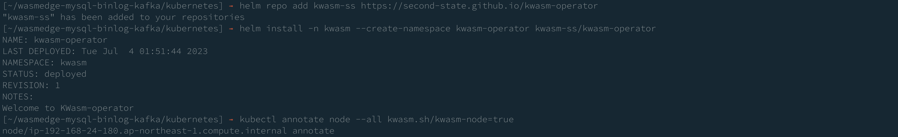
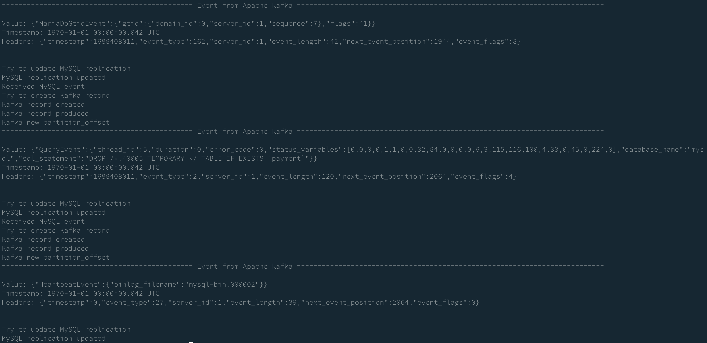

# Run in EKS

## Create EKS cluster with Ubuntu nodes

- Select an AMI that matches your Kubernetes version at <https://cloud-images.ubuntu.com/aws-eks/>.
- For `eksctl` requirements, please choose `AmazonLinux2` as the AMI family.
- To utilize `containerd` as the container runtime, use the `overrideBootstrapCommand`.

```bash
git clone https://github.com/second-state/wasmedge-mysql-binlog-kafka.git
cd wasmedge-mysql-binlog-kafka/kubernetes
eksctl create cluster -f eks-cluster.yml
```


## Setup kwasm

Since the default node name of EKS cluster is too long to use kwasm-operator. (see [this issue](https://github.com/KWasm/kwasm-operator/issues/21))
We forked kwasm-operator to use shorter job names at <https://github.com/second-state/kwasm-operator/actions>.

```bash
helm repo add kwasm-ss https://second-state.github.io/kwasm-operator
helm install -n kwasm --create-namespace kwasm-operator kwasm-ss/kwasm-operator
kubectl annotate node --all kwasm.sh/kwasm-node=true
```



## Setup Kafka

Here we use Apache Kafka from Bitnami. To customize the Kafka configuration,
please refer to <https://github.com/bitnami/charts/tree/main/bitnami/kafka>.

```bash
helm install kafka oci://registry-1.docker.io/bitnamicharts/kafka
```


The persistent volume claim for Kafka is not created automatically. Please create it manually.

```bash
export CLUSTER_NAME=kwasm

eksctl utils associate-iam-oidc-provider \
  --region=ap-northeast-1 \
  --cluster="$CLUSTER_NAME" \
  --approve

eksctl create iamserviceaccount \
  --name ebs-csi-controller-sa \
  --namespace kube-system \
  --cluster "$CLUSTER_NAME" \
  --attach-policy-arn arn:aws:iam::aws:policy/service-role/AmazonEBSCSIDriverPolicy \
  --approve \
  --role-only \
  --role-name AmazonEKS_EBS_CSI_DriverRole

eksctl create addon \
  --name aws-ebs-csi-driver \
  --cluster "$CLUSTER_NAME" \
  --service-account-role-arn arn:aws:iam::$(aws sts get-caller-identity --query Account --output text):role/AmazonEKS_EBS_CSI_DriverRole \
  --force
```


## Run the MySQL service

```bash
kubectl apply -f mysql.yml
```


## Get IP of service

Here we need IPs from the MySQL service and the Kafka service.

```bash
# kafka
kubectl get service/kafka -o=jsonpath='{.spec.clusterIP}'

# mysql
kubectl get service/mysql -o=jsonpath='{.spec.clusterIP}'
```

## Edit Binlog configuration

Before running the Binlog, we need to modify `binlog.yml` to set the IP of the MySQL service and the Kafka service.
Replace `<SQL_HOSTNAME>` and `<KAFKA_URL>` with the IPs from the previous step.

```yml
...
        - name: SQL_HOSTNAME
          value: 10.100.136.97
        - name: KAFKA_URL
          value: 10.100.118.7:9092
...
```

## Run the Binlog service

```bash
kubectl apply -f binlog.yml
```


## Check the logs from the Binlog service

```bash
kubectl logs deployment.apps/binlog-deployment
```


## Run the insert script & Check the logs

```bash
kubectl apply -f insert.yml
```


```bash
kubectl logs job.batch/insert
```


## Check the logs from the Binlog service, again

After running insert script, we can see the logs from the Binlog service.

```bash
kubectl logs deployment.apps/binlog-deployment
```


