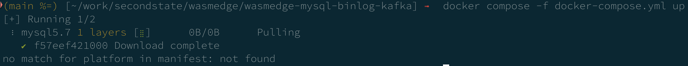
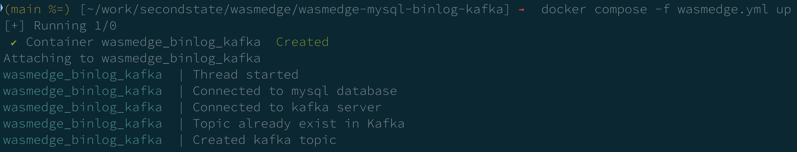
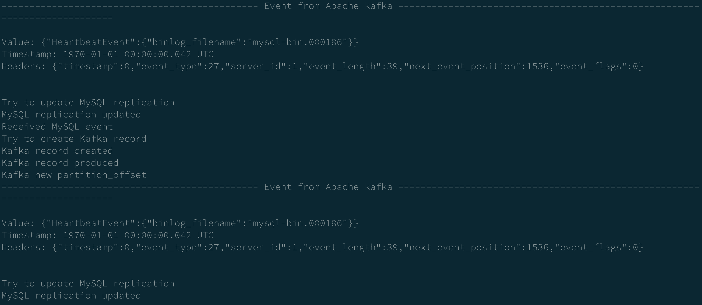

- Service: 用 [docker-compose.yml](https://github.com/second-state/wasmedge-mysql-binlog-kafka/blob/0dad6d4b7eb39397a577c3b79c1ffbdce2420fee/docker-compose.yml) 把 kafka + zookeeper + mysql 跑起來
- Wasm: 用 docker compose 把 [secondstate/mysql-binlog-kafka](https://hub.docker.com/r/secondstate/mysql-binlog-kafka/tags) 跑起來
- Env
    - A: M2 Max macOS Docker Desktop 4.19.0 Docker Client 23.0.5
    - B: Intel Ubuntu 20.04 Docker 23.0.4
    - C: Intel Ubuntu 20.04 ，直接用 wasmedge cli 跑 [secondstate/mysql-binlog-kafka](https://hub.docker.com/r/secondstate/mysql-binlog-kafka/tags) 裡面的 wasm file

| Env | Services         | Wasm             |
| --- | ---------------- | ---------------- |
| A   | X [^mac-service] | X [^mac-wasm]    |
| B   | O                | X [^ubuntu-wasm] |
| C   |                  | O [^wasmedge-wasm]                 |

[^mac-service]: no match for platform in manifest: not found 
[^mac-wasm]: 成功 connect ，但跑了 insert.wasm 之後沒有 log 
[^ubuntu-wasm]: operating system is not supported 
[^wasmedge-wasm]: 跑了 insert.wasm 之後有成功出現 log 
